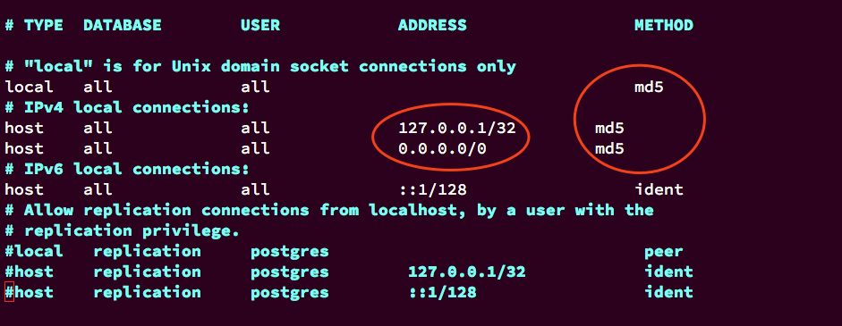
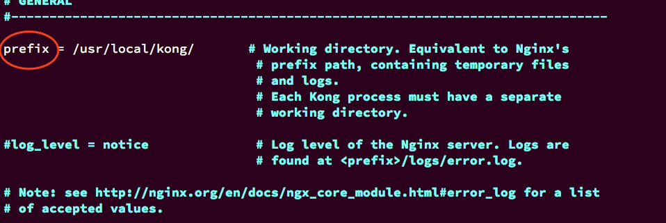
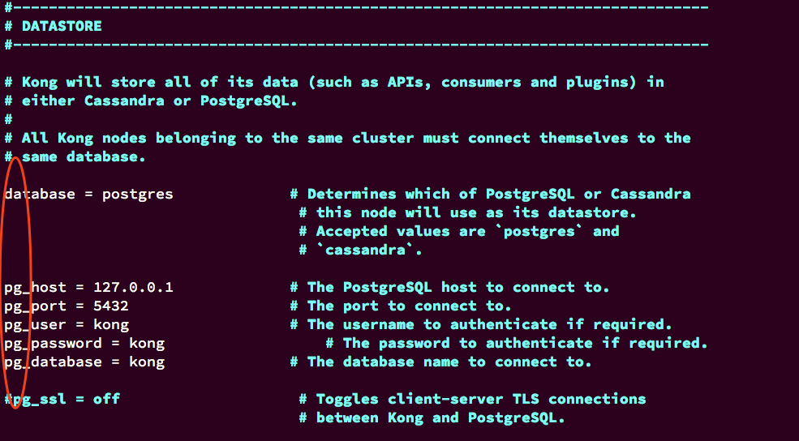
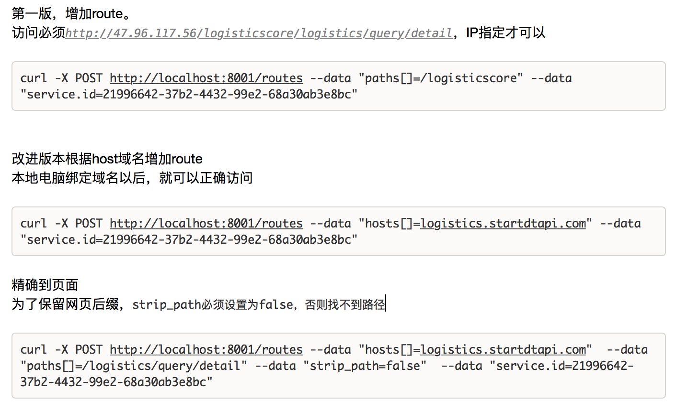

### 安装PG
```
yum install https://download.postgresql.org/pub/repos/yum/9.6/redhat/rhel-7-x86_64/pgdg-redhat96-9.6-3.noarch.rpm
yum install postgresql96
yum install postgresql96-server
```
### 初始化数据库
```
/usr/pgsql-9.6/bin/postgresql96-setup initdb
systemctl enable postgresql-9.6
systemctl start postgresql-9.6
```
##### 编译配置文件
```
vi /var/lib/pgsql/9.6/data/postgresql.conf
```
需要更改相关的内容：listen_addresses = '*'

```
vi /var/lib/pgsql/9.6/data/pg_hba.conf
```


```
systemctl restart postgresql-9.6
psql -U postgres
su - postgres
psql -U kong -d kong -h 127.0.0.1
ALTER USER postgres WITH PASSWORD 'startdt1234';
alter user kong with password 'kong';
GRANT ALL PRIVILEGES ON DATABASE kong to kong;
systemctl restart postgresql-9.6
cp kong.conf.default kong.conf
```
  



```
kong migrations up
ulimit -n
启动kong
kong start
```

增加 upstreams

curl -X POST http://localhost:8001/upstreams --data "name=logisticscore"


增加 target

curl -X POST http://localhost:8001/upstreams/logisticscore/targets --data "target=172.16.3.6:7070" --data "weight=100"

curl -X POST http://localhost:8001/upstreams/logisticscore/targets --data "target=172.16.3.11:7070" --data "weight=100"


增加 service

curl -X POST http://localhost:8001/services --data "name=logisticscore" --data "host=logisticscore"


增加 routes

curl -X POST http://localhost:8001/routes --data "paths[]=/logistics/query/detail" --data "hosts[]=logistics.startdtapi.com" --data "service.id=c0b92f99-ae31-48b3-bd27-3b6484b5906a"

curl -X POST http://localhost:8001/routes --data "paths[]=/logistics/subscribe" --data "hosts[]=logistics.startdtapi.com" --data "service.id=c0b92f99-ae31-48b3-bd27-3b6484b5906a"


增加 plugins

curl -X POST http://localhost:8001/routes/de2c8465-c9ca-4522-a457-db232f1dbe2f/plugins --data "name=rate-limiting" --data "config.minute=2"



